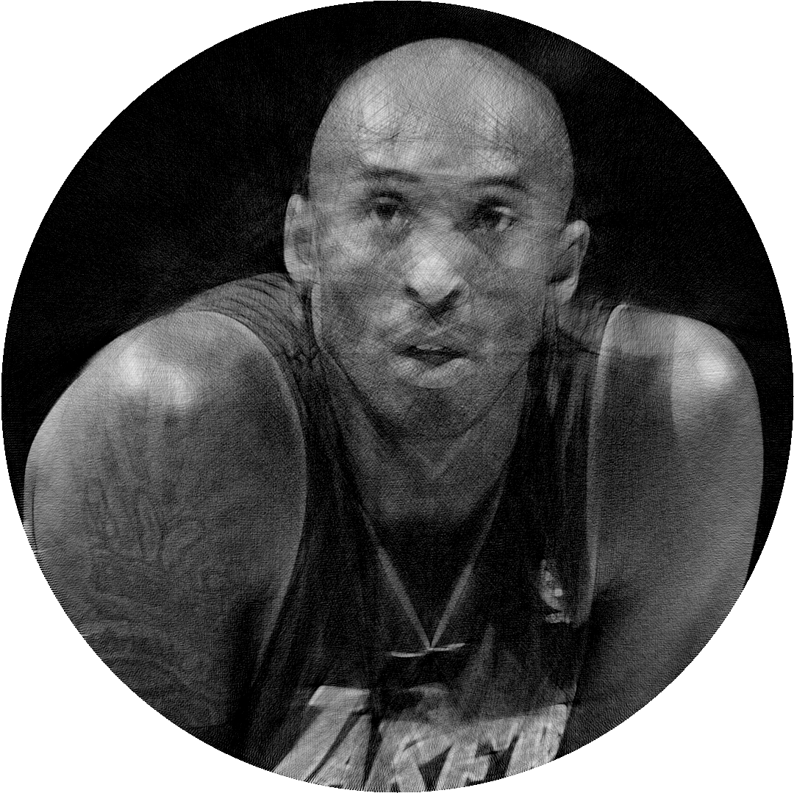

# STRINGIFY



## Description
STRINGIFY is a program that takes a PPM file as input and outputs a stringified version of the same 
image. Additionally, the program can create a video clip of the artwork as it is being created.

## Dependencies
- `gcc`: or any other compiler
- `make`: recommended for building the program
- `ffmpeg`: recommended for converting between various image and video file formats, particulary
for use with `.ppm` for images and `.y4m` for videos.

### Converting Files with `ffmpeg`

```bash
# Convert an image to PPM
ffmpeg -i image.png image.ppm

# Convert a PPM image to another format
ffmpeg -i image.ppm image.png

# Convert a Y4M video to another format
ffmpeg -i video.y4m video.mp4
```

## Usage
Build the project using `make`:
```bash
./stringify
```
Run the program with the following syntax:
```bash
./stringify <image_in>.ppm <image_out>.ppm [<video_out>.y4m] [lines_per_frame] [fps]
```

### Example
Create a stringified image:
```bash
./stringify input.ppm ouput.ppm
```
Create a stringified image and video clip:
```bash
./stringify input.ppm ouput.ppm video.y4m 100 30
```

### Makefile
For more details, take a look at the Makefile included in the project.

## Advanced Configuration
To adjust parameters such as the number of lines and thickness in the drawing, modify the `#define`
statements in the source code.

For enabling tracing, uncomment the line in the code that ends with `// trace`.
